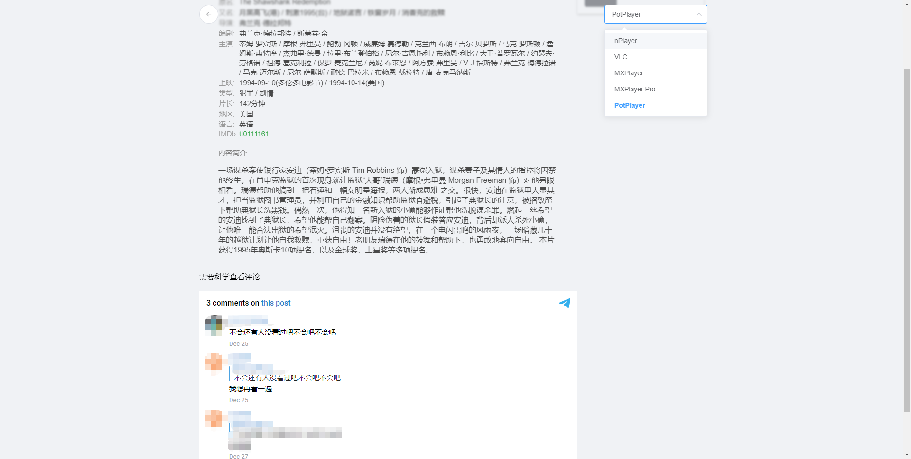

# LocalMovieDB
基于豆瓣信息的（简易）本地电影数据库（Web），用于NAS电影检索。

## 功能
- 抓取本地电影豆瓣信息
- Web页面展示电影列表和播放页面（调用PC、移动端视频APP）
- 标题搜索、排序、Tag筛选

## 使用
1. `docker pull ghcr.io/rocket-factory/localmoviedb:latest`
2. 修改路径、端口映射并运行`docker run -d --name moviedb -v /<自定义数据保存路径>/moviedbdata:/app/data -v /mnt/<影视路径1>:/mnt/media/1 -v /mt/<影视路径2>:/mnt/media/2 -p 5006:8080 --restart=always ghcr.io/rocket-factory/localmoviedb:latest`
3. 访问web页面(http://xxx.xxx.xxx.xx:5006)进行初始化

## 注意
1. 电影路径格式要求：默认为`豆瓣电影名（年份）`，路径内需存在视频文件（mkv/mp4/ts/flv）。
2. 豆瓣API会去获取电影和剧集的信息，如不存在可能会导致数据库收录和推送失败，详见`https://moviedb.8610000.xyz/`。

## 更新
### 2023-01-16(maia)
1. 修复重复抓取信息问题

### 2023-01-14(maia)
1. 优化后端逻辑
2. 新增初始化页面
3. 前端Bug修复和效果优化
4. 自动构建并简化使用流程

### 2021-12-30
1. 修复翻页加载bug
2. 修复播放列表显示不全的bug

### 2021-12-29
1. 修复大量bug（可以推送）

### 2021-12-28
1. 修复大量bug

### 2021-12-27
1. docker化（推送还没有)

### 2021-09-11
1. 播放页提示文件名

### 2021-06-28
1. 电影详情页增加相似影片

### 2021-06-11
1. 新增PWA(IOS)启动页
2. 更新PWA提示
3. 新增flv文件检索

### 2021-05-15
1. 修复UI的各种BUG
2. 添加PWA提示

### 2021-04-09
1. UI优化（IOS PWA）
2. 移除fileserver
3. 修复重复推送Bug

### 2021-02-21
1. UI更新（主要是详情页）
2. 修复滚动加载的Bug
3. 新增自带fileserver（仅X86）
4. 新增Server酱推送
5. 数据库结构变化，需要删除db文件重新获取

### 2021-01-17
1. 切换API到Github Pages，避免服务器流量问题

### 2021-01-03
1. 修复bug，优化细节
2. 支持IOS PWA（Safari 添加到主屏幕）
3. 详情页返回不再重载首页
4. 新增IINA播放

### 2020-12-28
- `legolas`分支重写了Web页面
- 适配Potplayer和VLC（移动端）
- 合并推送功能（TansmissionNotify不再更新）
- 新增绑定Telegram消息评论功能（需公开群组或频道）
- 修复BUG

### 2020-11-10
- 修复API问题
- 新增视频app快捷播放页面
- 新增简介
